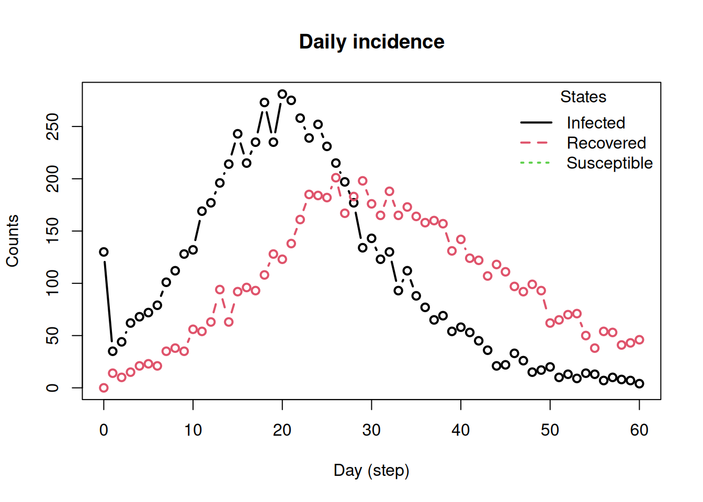
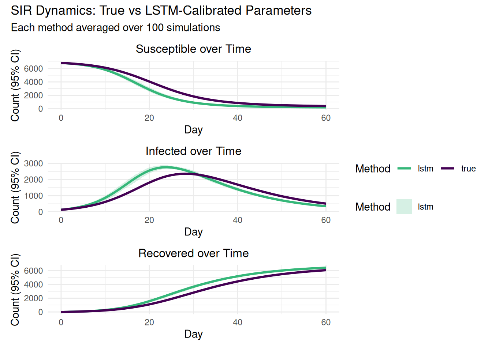

# Introduction to LSTM-based Calibration (One-Line Usage)

## Overview

This vignette shows how to: 1) simulate an epidemic using **epiworldR**,
and  
2) obtain calibrated SIR parameters using
**[`calibrate_sir()`](https://sima-njf.github.io/epiworldRcalibrate/reference/calibrate_sir.md)**
from **epiworldRcalibrate**.

> ✅ **No Python setup required.** The package initializes the Python
> model internally the first time you call
> [`calibrate_sir()`](https://sima-njf.github.io/epiworldRcalibrate/reference/calibrate_sir.md)
> and cleans up automatically when asked.

## Libraries

``` r
library(tidyverse)
```

    ── Attaching core tidyverse packages ──────────────────────── tidyverse 2.0.0 ──
    ✔ dplyr     1.1.4     ✔ readr     2.1.6
    ✔ forcats   1.0.1     ✔ stringr   1.6.0
    ✔ ggplot2   4.0.1     ✔ tibble    3.3.0
    ✔ lubridate 1.9.4     ✔ tidyr     1.3.1
    ✔ purrr     1.2.0
    ── Conflicts ────────────────────────────────────────── tidyverse_conflicts() ──
    ✖ dplyr::filter() masks stats::filter()
    ✖ dplyr::lag()    masks stats::lag()
    ℹ Use the conflicted package (<http://conflicted.r-lib.org/>) to force all conflicts to become errors

``` r
library(ggplot2)
library(patchwork)
library(epiworldR)
```

    Thank you for using epiworldR! Please consider citing it in your work.
    You can find the citation information by running
      citation("epiworldR")

    Attaching package: 'epiworldR'

    The following object is masked from 'package:lubridate':

        today

``` r
library(epiworldRcalibrate)
```

## Ground-Truth Parameters and Simulation

We draw a single SIR parameter set and simulate 60 days.

``` r
set.seed(122)

# Draw a single parameter set
n_value <- sample(5000:10000, 1)
preval   <- runif(1, 0.007, 0.02)
crate    <- runif(1, 1, 5)
recov    <- runif(1, 0.071, 0.25)
R0_true  <- runif(1, 1.1, 5)
ptran    <- R0_true * recov / crate

true_params <- tibble(
  n = n_value,
  prevalence = preval,
  contact_rate = crate,
  transmission_rate = ptran,
  recovery_rate = recov,
  R0 = R0_true
)

true_params
```

    # A tibble: 1 × 6
          n prevalence contact_rate transmission_rate recovery_rate    R0
      <int>      <dbl>        <dbl>             <dbl>         <dbl> <dbl>
    1  6967     0.0188         1.76             0.149        0.0783  3.36

``` r
ndays <- 60
true_model <- ModelSIRCONN(
  name = "true_simulation",
  n = true_params$n,
  prevalence = true_params$prevalence,
  contact_rate = true_params$contact_rate,
  transmission_rate = true_params$transmission_rate,
  recovery_rate = true_params$recovery_rate
)
run(true_model, ndays = ndays)
```

    _________________________________________________________________________
    |Running the model...
    |||||||||||||||||||||||||||||||||||||||||||||||||||||||||||||||||||||||| done.
    |

``` r
# Extract daily incidence (length must be 61: day 0..60)
inc_plot <- plot_incidence(true_model, plot = TRUE)
```



``` r
incidence_ts <- inc_plot[, 1]
length(incidence_ts)  # should be 61
```

    [1] 61

## Calibrate SIR Parameters (One line)

[`calibrate_sir()`](https://sima-njf.github.io/epiworldRcalibrate/reference/calibrate_sir.md)
automatically:

- initializes the BiLSTM model (if not already loaded),
- preprocesses the series,
- predicts **ptran**, **crate**, and **R0**,
- and returns a named vector.

``` r
lstm_predictions <- calibrate_sir(
  daily_cases = incidence_ts,
  population_size = true_params$n,
  recovery_rate = true_params$recovery_rate
)
```

    Model not loaded. Initializing automatically...

    Python environment initialized.

    BiLSTM model loaded successfully. Ready to estimate SIR parameters.

``` r
cat("LSTM Parameter Predictions:\n")
```

    LSTM Parameter Predictions:

``` r
lstm_predictions
```

        ptran     crate        R0
    0.1043283 3.0130329 3.3652871 

Turn predictions into a tidy frame for comparison:

``` r
lstm_params <- tibble(
  n = true_params$n,
  prevalence = true_params$prevalence,
  contact_rate = lstm_predictions[["crate"]],
  transmission_rate = lstm_predictions[["ptran"]],
  recovery_rate = true_params$recovery_rate,
  R0 = lstm_predictions[["R0"]]
)

params_comparison <- bind_rows(
  true_params %>% mutate(param_type = "true"),
  lstm_params %>% mutate(param_type = "lstm")
)

params_comparison
```

    # A tibble: 2 × 7
          n prevalence contact_rate transmission_rate recovery_rate    R0 param_type
      <int>      <dbl>        <dbl>             <dbl>         <dbl> <dbl> <chr>
    1  6967     0.0188         1.76             0.149        0.0783  3.36 true
    2  6967     0.0188         3.01             0.104        0.0783  3.37 lstm      

## What preprocessing does the model use?

For transparency (not required for users),
[`show_preprocessing()`](https://sima-njf.github.io/epiworldRcalibrate/reference/show_preprocessing.md)
demonstrates the percentage-change transform applied internally.

``` r
preprocessing_demo <- show_preprocessing(incidence_ts[1:10])
```

    Note: For model predictions, you need exactly 61 days. Currently showing 10 days.

``` r
preprocessing_demo
```

       day raw_count percentage_change
    1    0       130            0.0000
    2    1        35           -0.7308
    3    2        44            0.2571
    4    3        62            0.4091
    5    4        68            0.0968
    6    5        72            0.0588
    7    6        79            0.0972
    8    7       101            0.2785
    9    8       112            0.1089
    10   9       128            0.1429

## Forward Simulations: True vs LSTM Parameters

We run multiple replicates with the true parameters and with the
LSTM-calibrated parameters to compare dynamics.

``` r
n_reps <- 100
all_simulation_results <- tibble()

for (i in seq_len(nrow(params_comparison))) {
  row <- params_comparison[i, ]

  forward_model <- ModelSIRCONN(
    name = paste0("forward_", row$param_type),
    n = row$n,
    prevalence = row$prevalence,
    contact_rate = row$contact_rate,
    transmission_rate = row$transmission_rate,
    recovery_rate = row$recovery_rate
  )

  saver <- make_saver("total_hist")
  run_multiple(forward_model, ndays = ndays, nsims = n_reps, saver = saver, nthreads = 8)
  results <- run_multiple_get_results(forward_model, nthreads = 2)

  sim_data <- results$total_hist %>%
    group_by(date, state) %>%
    summarize(
      mean_count = mean(counts),
      ci_lower   = quantile(counts, 0.025),
      ci_upper   = quantile(counts, 0.975),
      .groups = "drop"
    ) %>%
    mutate(param_type = row$param_type)

  all_simulation_results <- bind_rows(all_simulation_results, sim_data)
}
```

    Starting multiple runs (100) using 8 thread(s)
    _________________________________________________________________________
    _________________________________________________________________________
    ||||||||||||||||||||||||||||||||||||||||||||||||||||||||||||||||||||||||| done.
    Starting multiple runs (100) using 8 thread(s)
    _________________________________________________________________________
    _________________________________________________________________________
    ||||||||||||||||||||||||||||||||||||||||||||||||||||||||||||||||||||||||| done.

### Visualize S, I, R Trajectories

``` r
method_colors <- c("true" = "#440154FF", "lstm" = "#35B779FF")

create_sir_plot <- function(data, state_name, title) {
  plot_data <- data %>% filter(state == state_name)
  ggplot(plot_data, aes(x = date, color = param_type)) +
    geom_ribbon(
      data = plot_data %>% filter(param_type == "lstm"),
      aes(ymin = ci_lower, ymax = ci_upper, fill = param_type),
      alpha = 0.2, color = NA
    ) +
    geom_line(aes(y = mean_count), linewidth = 1.1) +
    scale_color_manual(values = method_colors) +
    scale_fill_manual(values = method_colors) +
    labs(title = title, x = "Day", y = "Count (95% CI)", color = "Method", fill = "Method") +
    theme_minimal() +
    theme(legend.position = "bottom", plot.title = element_text(size = 12, hjust = 0.5))
}

p_sus <- create_sir_plot(all_simulation_results, "Susceptible", "Susceptible over Time")
p_inf <- create_sir_plot(all_simulation_results, "Infected",    "Infected over Time")
p_rec <- create_sir_plot(all_simulation_results, "Recovered",   "Recovered over Time")

(p_sus / p_inf / p_rec) + plot_layout(guides = "collect") +
  plot_annotation(
    title = "SIR Dynamics: True vs LSTM-Calibrated Parameters",
    subtitle = paste0("Each method averaged over ", n_reps, " simulations")
  )
```



## Bias Tables

### Parameter Bias

``` r
param_bias <- tibble(
  Parameter = c("Contact Rate", "Transmission Rate", "R0"),
  True = c(true_params$contact_rate, true_params$transmission_rate, true_params$R0),
  LSTM = c(lstm_params$contact_rate, lstm_params$transmission_rate, lstm_params$R0)
) %>%
  mutate(
    Bias = LSTM - True,
    Relative_Bias = (LSTM - True) / True * 100
  )

param_bias
```

    # A tibble: 3 × 5
      Parameter          True  LSTM     Bias Relative_Bias
      <chr>             <dbl> <dbl>    <dbl>         <dbl>
    1 Contact Rate      1.76  3.01   1.25           71.0
    2 Transmission Rate 0.149 0.104 -0.0449        -30.1
    3 R0                3.36  3.37   0.00690         0.205
